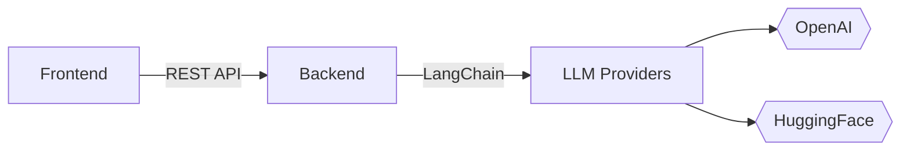

# NeuroLearn - AI Course Builder (Frontend) 🎨
Реализация кейса от банка Центр-Инвест.
Вот адаптированный README под текущее состояние проекта:

[](https://opensource.org/licenses/MIT)


> **Статус**: Активная разработка фронтенд-части  
> Бэкенд и ML-модули - в процессе разработки

## 🌟 Ключевые возможности интерфейса

- Интерактивный конструктор курсов
- WYSIWYG/Markdown редактор с подсветкой синтаксиса
- Система управления учебными модулями
- Предпросмотр контента в реальном времени
- Адаптивный интерфейс для разных устройств
- Интеграция с mock-API для тестирования

## 🛠 Технологический стек


| Категория       | Технологии                                                                 |
|-----------------|----------------------------------------------------------------------------|
| Ядро            | React 18, Vite 4, TypeScript 5                                             |
| State Management| Zustand 4 + Immer                                                          |
| UI Библиотеки   | shadcn/ui, Tailwind CSS 3, daisyUI 3                                       |
| Формы           | React Hook Form 7 + Zod-валидация                                          |
| Работа с текстом| react-markdown 8, CodeMirror 6                                             |
| Тестирование    | Vitest 1, React Testing Library 14                                         |
| Инфраструктура  | Vercel, GitHub Actions                                                     |

## 🚀 Запуск проекта

**Требования**: Node.js 18+ 

```bash
# Клонирование репозитория
git clone https://github.com/NeuroFlexDev/ciFront.git
cd ciFront

# Установка зависимостей
npm install

# Запуск dev-сервера
npm run dev

# Сборка для production
npm run build
```

## 📌 Планы по интеграции



## 📚 Ресурсы

- [Figma-дизайн](https://www.figma.com/...)
- [Miro-архитектура](https://miro.com/...)
- [Дорожная карта](/ROADMAP.md)

---
*Банк Центр-Инвест* • 2025
```
