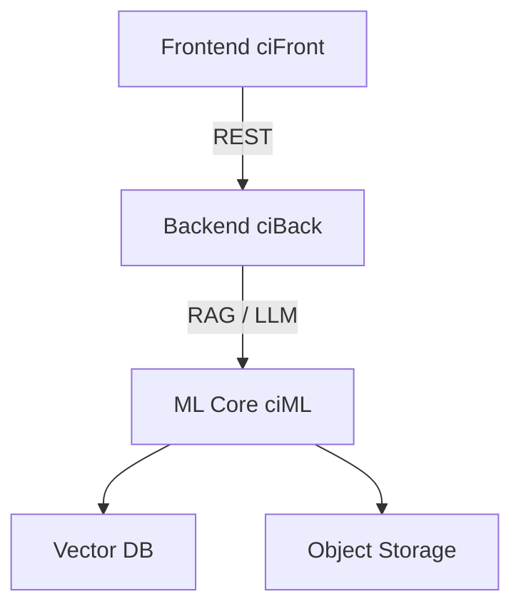

# 🧠 NeuroLearn — AI Course Builder

Проект для создания и редактирования онлайн-курсов с помощью ИИ.  
Разработан в рамках кейса **Банка Центр-Инвест**.

---

## 🧩 Состав проекта

| Репозиторий | Назначение                          | Статус            |
|-------------|-------------------------------------|--------------------|
| [`ciFront`](./ciFront) | Клиентская часть (React + Vite)      | 🚧 Активная разработка |
| [`ciBack`](./ciBack)   | Бэкенд на FastAPI                    | ✅ MVP реализован      |
| [`ciML`](./ciML)       | Модели и генерация контента (RAG/LLM) | 🧪 Исследование/интеграция |

---

## 🔌 Интеграция



---

## 🚀 Возможности

- Генерация структуры курса, модулей, уроков
- Интерактивное редактирование и экспорт
- Интеграция с HuggingChat / LangChain / FAISS
- Поддержка теории, заданий, тестов
- Web-интерфейс + OpenAPI

---

## 🗺️ Дорожная карта

```markdown
- [x] CRUD для курсов, модулей, уроков
- [x] Генерация с HuggingChat
- [x] Обратная связь и оценка уроков
- [x] Подключение теорий и векторный поиск
- [x] Экспорт в PDF / Markdown
- [ ] Роли и права (преподаватель/студент)
- [ ] Режим прохождения курса
- [ ] Админ-панель и аналитика
```

---

## 📚 Полезные ссылки

- 🎨 [Figma-дизайн](https://www.figma.com/design/mCBsEO0lXXeQTMSf7IgWEj/AI-Course-Builder)
- 📊 [Miro-архитектура](https://miro.com/welcomeonboard/Y2NJR2pRRnI1dXFxMkVD...)
- 🛣️ [Roadmap](./ROADMAP.md)

---

## 💡 Миссия проекта

**NeuroFlex**: *Показать всем буйство нейронов. Организовать движение, которое потрясёт мир.*

> Поддержите проект ⭐ и делитесь фидбеком!
