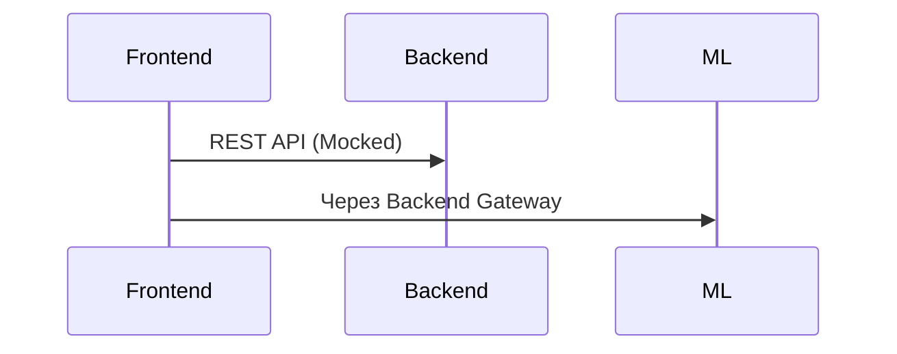
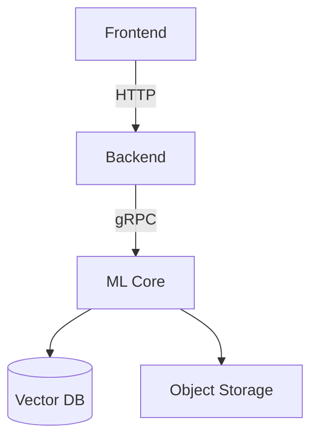

# NeuroLearn - AI Course Builder (Frontend) 🎨
Реализация кейса от банка Центр-Инвест.
Вот адаптированный README под текущее состояние проекта:

[](https://opensource.org/licenses/MIT)


> **Статус**: Активная разработка фронтенд-части  
> Бэкенд и ML-модули - в процессе разработки

## 🌟 Ключевые возможности интерфейса

- Интерактивный конструктор курсов
- WYSIWYG/Markdown редактор с подсветкой синтаксиса
- Система управления учебными модулями
- Предпросмотр контента в реальном времени
- Адаптивный интерфейс для разных устройств
- Интеграция с mock-API для тестирования

# 1. Frontend Repository (`ciFront`) 🖥️

```markdown
# AI Course Builder - Frontend

[](https://opensource.org/licenses/MIT)


## Основной стек

| Категория       | Технологии                          | Версии    |
|-----------------|-------------------------------------|-----------|
| Ядро            | React, Vite, TypeScript             | 18, 4, 5  |
| State           | Zustand, Immer                      | 4, 10     |
| UI              | shadcn/ui, Tailwind, daisyUI        | 0.5, 3, 3 |
| Редакторы       | CodeMirror, react-markdown          | 6, 8      |
| Тестирование    | Vitest, Testing Library             | 1, 14     |
| Инфраструктура  | Vercel, GitHub Actions              | -         |

## Особенности реализации
- Динамическая загрузка редакторов
- Адаптивная сетка модулей
- Mock API через MSW
- Lazy-загрузка тяжелых компонентов

## Интеграция


---

# 2. Backend Repository (`ciBack`) ⚙️

```markdown
# AI Course Builder - Backend

[](https://python.org)
[](https://fastapi.tiangolo.com)

| Категория       | Технологии                          | Назначение                  |
|-----------------|-------------------------------------|-----------------------------|
| Фреймворк       | FastAPI, Uvicorn                    | API ядро                    |
| Валидация       | Pydantic, Typeguard                 | Модели данных               |
| БД              | Redis, PostgreSQL                   | Кеш и хранение              |
| Инфраструктура  | Docker, Kubernetes                  | Оркестрация                 |
| Модули          | LangChain, JWT                      | Интеграция с ML, Auth       |

## Сервисная архитектура
```
services/
├── auth
├── course-generator
├── content-storage
└── integrations
```

---

# 3. ML Repository (`ciML`) 🧠

```markdown
# AI Course Builder - ML Core

[](https://pytorch.org)
[](https://huggingface.co)


| Категория       | Технологии                          | Назначение                  |
|-----------------|-------------------------------------|-----------------------------|
| Модели          | HuggingFace, OpenAI API             | Базовые LLM                 |
| RAG             | LangChain, FAISS                    | Контекстный поиск           |
| NLP             | spaCy, SentenceTransformers         | Обработка текста            |
| Оптимизация     | ONNX, Quantization                  | Ускорение инференса         |
| Мониторинг      | MLflow, Prometheus                  | Трекинг экспериментов       |

## Паттерны использования
- Цепочки генерации через LCEL
- Динамическая загрузка адаптеров LoRA
- Пакетная обработка через Ray

---

## Связи между репозиториями


## 📚 Ресурсы

- [Figma-дизайн](https://www.figma.com/...)
- [Miro-архитектура](https://miro.com/...)
- [Дорожная карта](/ROADMAP.md)

---
*Банк Центр-Инвест* • 2025
```

    Miro-архитектура

    Дорожная карта
